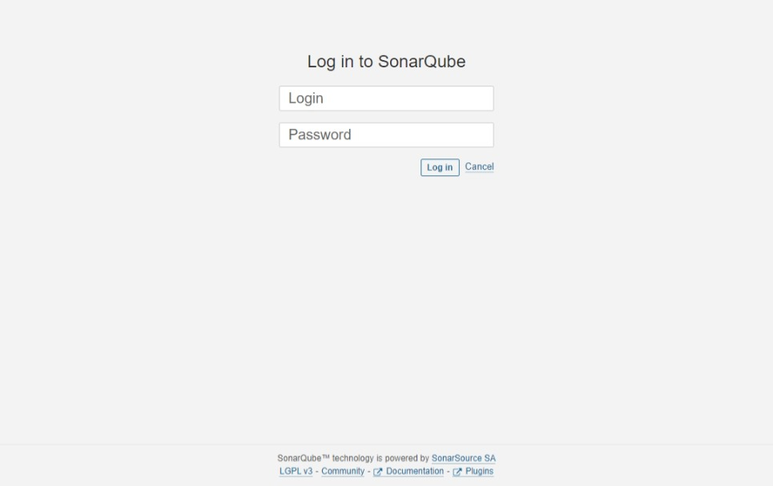
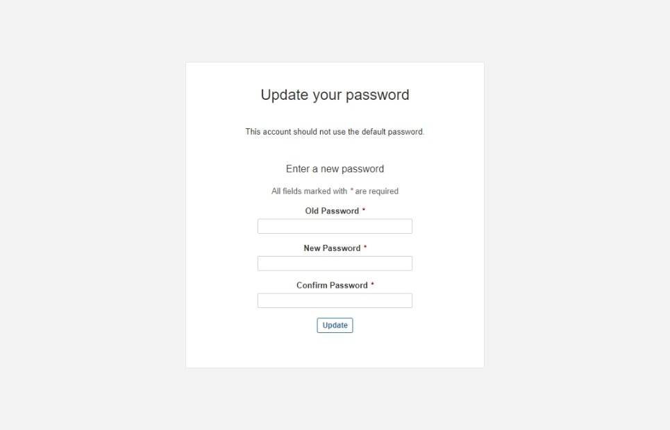
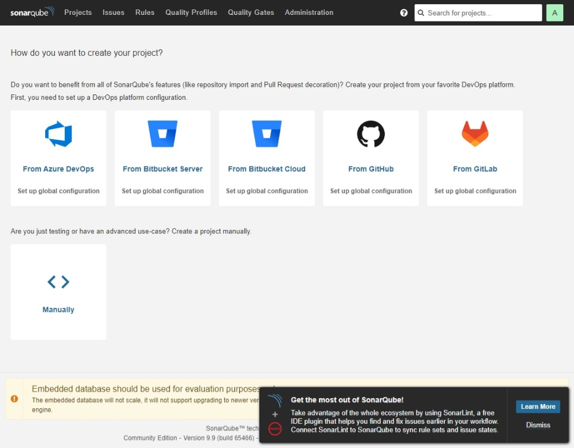
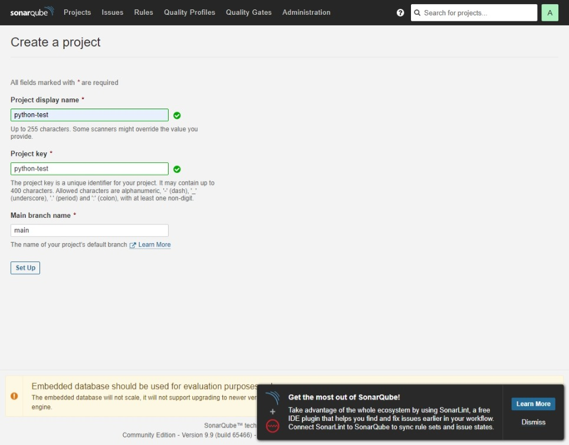
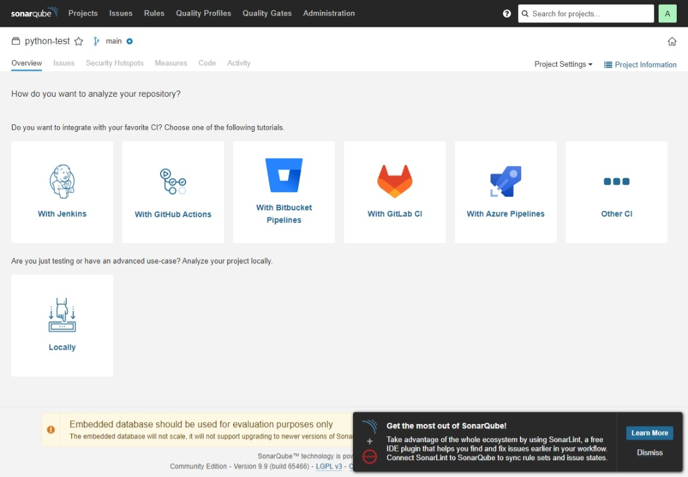
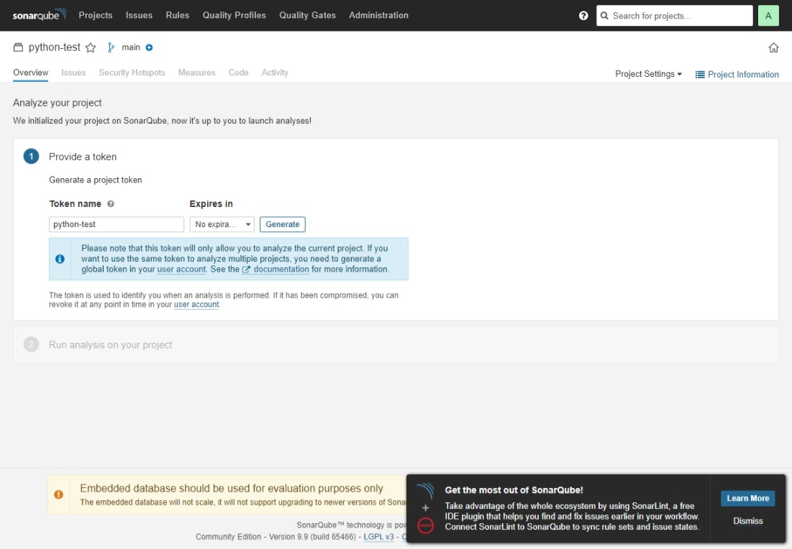
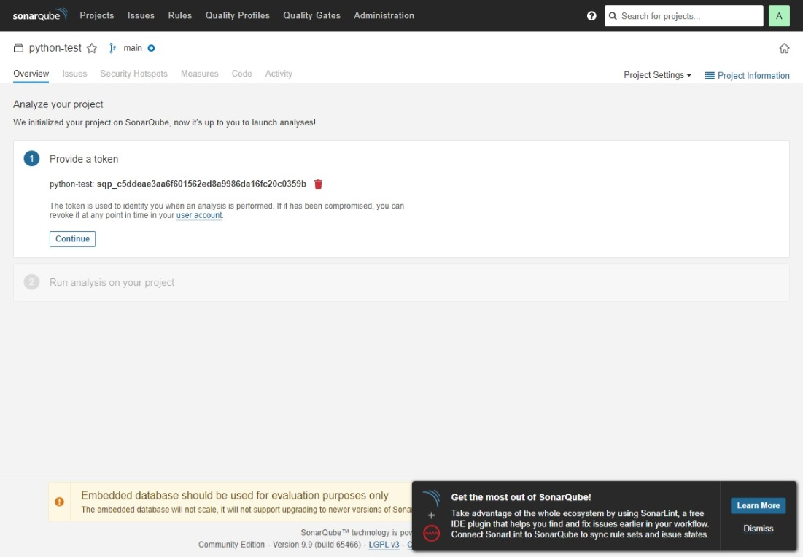
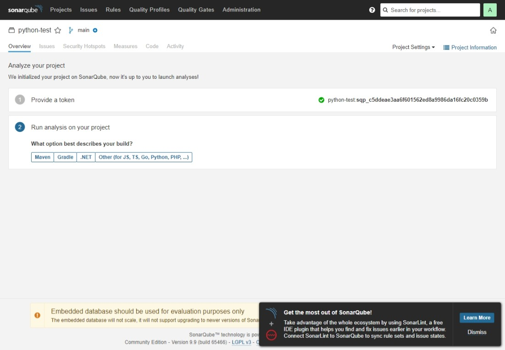
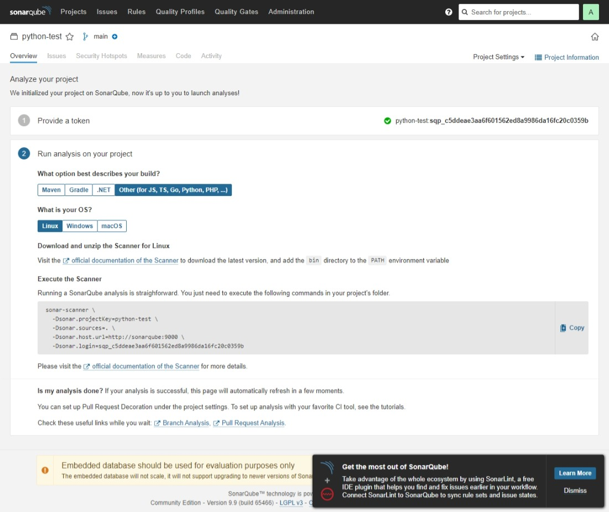

SonarQubeの設定
###############

ログイン画面
============

======== ==================================
項目     値
======== ==================================
URL      http://sonarqubeのIPアドレス:9000/
Login ID admin
Password admin
======== ==================================

で、初回ログイン時に強制的に変更を促されます。

パスワード変更を行うとホーム画面に遷移します。

プロジェクトの登録
==================

| ここでは Subversion リポジトリ名に合わせて **python-test** という名称でジョブを登録します。
| ホーム画面の `Manually` から **Create a project** 画面に遷移します。

`Set Up` ボタンを押下すると下記の画面に遷移します。

Jenkins と連携する予定ですが、とりあえず `Locally` を選択します。

REST API 用のトークンを発行し、

言語を選択し、

| OS を選択すると、soner-scanner コマンドのコマンド引数が出力されます。
| この soner-scanner コマンドをテキストエディタ等にコピーしておきます。
