Jenkinsの設定
#############

.. note::

    | 　JenkinsコンテナではJenkinsのアプリ本体、設定ファイル、プラグイン等を `/var/jenkins_home` に格納します。このディレクトリが永続でない場合、Jenkinsコンテナを停止させると、それまでの設定がリセットされ初期化からやり直しになります。
    | 　そこで、`/var/jenkins_home` をホストOSのファイルシステムに割り当てると、コンテナ起動時、空ディレクトリとなるため、コンテナが正常に起動できません。
    | というわけで、

    1. 一旦、永続化無しで起動
    2. `/var/jenkins_home` ディレクトリの内容をバックアップ
    3. ホストOSのディレクトリでバックアップを展開
    4. #3のディレクトリを `/var/jenkins_home` に設定して起動

    という作業をしておくと、Jenkinsコンテナを止めた後も復旧できます。

初回ログイン時
==============

Administrator Passwordの入力
----------------------------

| ブラウザで ``IPアドレス:8080`` を参照すると下記のような画面が表示されます。
| **Administrator password** には下記コマンドの結果を貼り付けます。

.. code:: bash

    docker exec jenkins cat /var/jenkins_home/secrets/initialAdminPassword

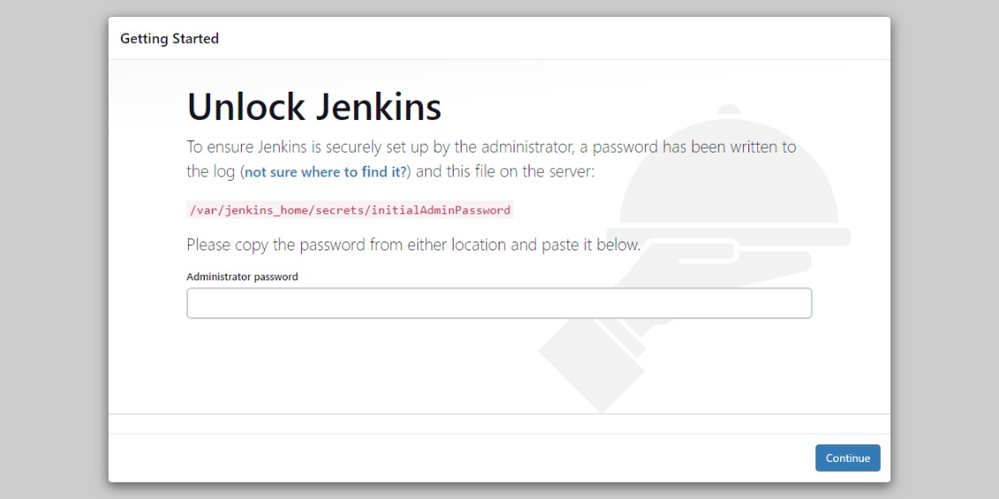

Customize Jenkins
-----------------

プラグイン選択については、特に思い入れがなければ ``Install suggested plugins`` でよいと思います。

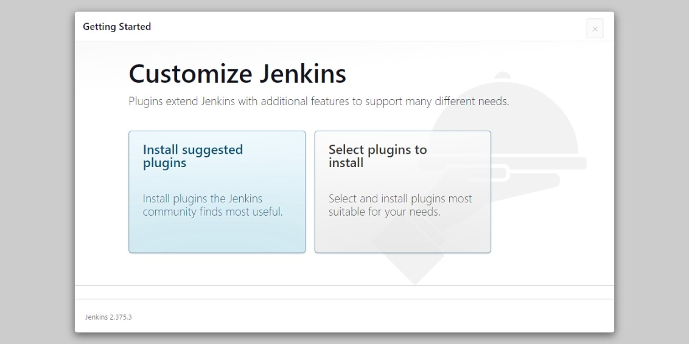

Admin User の登録
-----------------

管理者ユーザ情報を入力します。

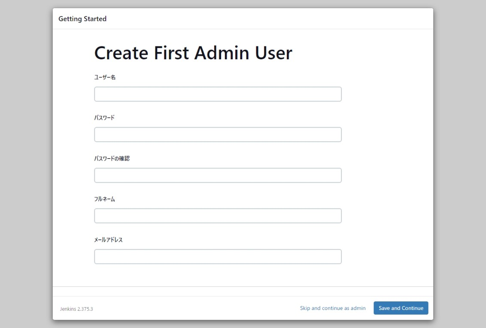

Instance Configuration
----------------------

JenkinsサーバのURLを設定します。``Not now`` が選択できるので、あとで設定変更できます。

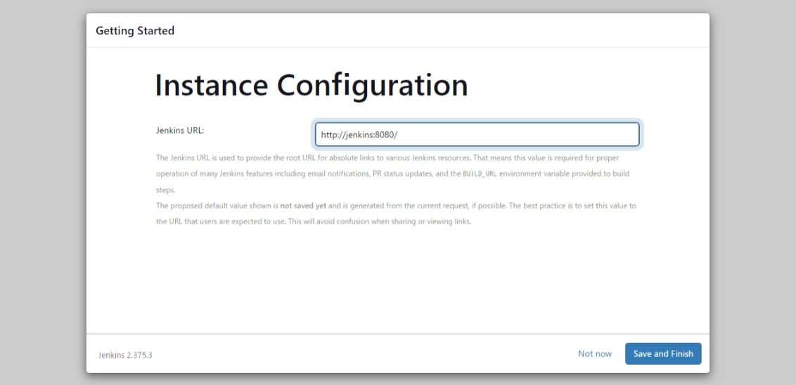

初期設定完了画面 ⇒ ホーム画面
------------------------------

``Start using Jenkins`` ボタンを押下すると、ホーム画面に遷移します。

* 初期設定完了画面

    .. image:: ./04_jenkins/jenkins_Geting_Start_05_JenkinsReady.jpeg

* ホーム画面

    .. image:: ./04_jenkins/jenkins_Home.jpeg

ジョブの登録
============

ジョブ名称と種類
----------------

| ここでは、Subversionリポジトリ名に合わせて **python-test** という名称でジョブを登録します。
| ジョブの種類は ``パイプライン`` を選択します。

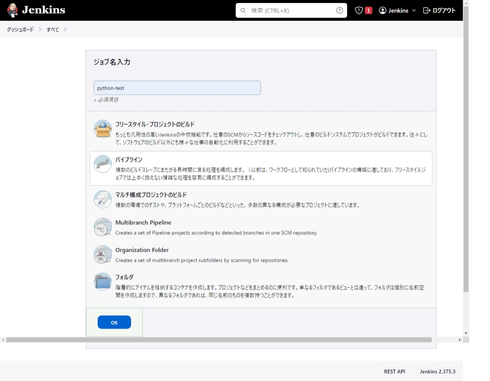

パイプラインスクリプト
----------------------

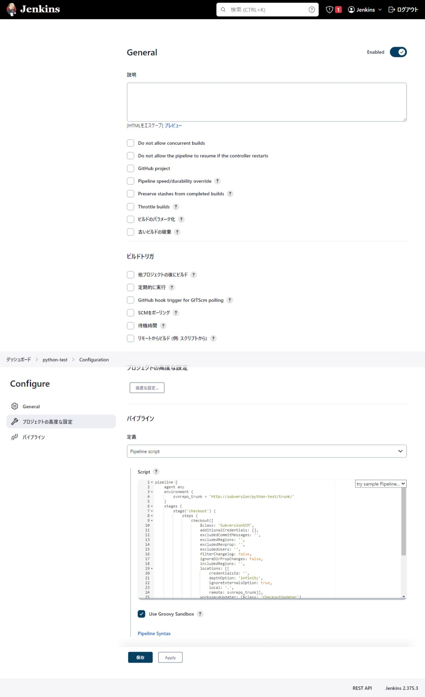

.. code:: jenkins

    pipeline {
        agent any
        environment {
            svnrepo_trunk = 'http://svn/python-test/trunk/'
        }
        stages {
            stage('checkout') {
                steps {
                    checkout([
                        $class: 'SubversionSCM',
                        additionalCredentials: [],
                        excludedCommitMessages: '',
                        excludedRegions: '',
                        excludedRevprop: '',
                        excludedUsers: '',
                        filterChangelog: false,
                        ignoreDirPropChanges: false,
                        includedRegions: '',
                        locations: [[
                            credentialsId: '',
                            depthOption: 'infinity',
                            ignoreExternalsOption: true,
                            local: '.',
                            remote: svnrepo_trunk]],
                        workspaceUpdater: [$class: 'CheckoutUpdater']
                    ])
                }
            }
            stage('test') {
                steps {
                    sh "coverage erase"
                    sh "coverage run --source=./ -m pytest -v"
                    sh "coverage report"
                    sh "coverage xml -i"
                    sh "sonar-scanner"
                }
            }
        }
    }

ジョブ用のAPIキーの発行
=======================

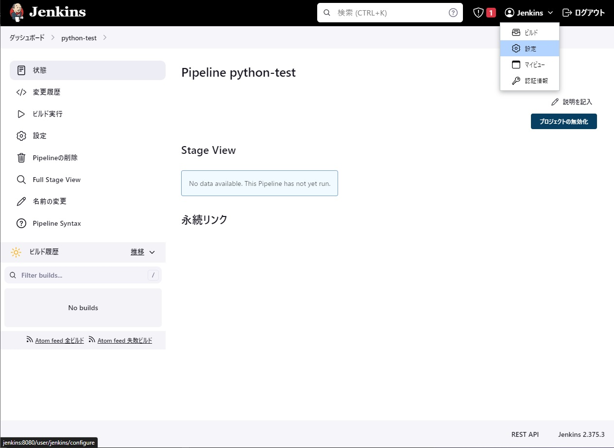
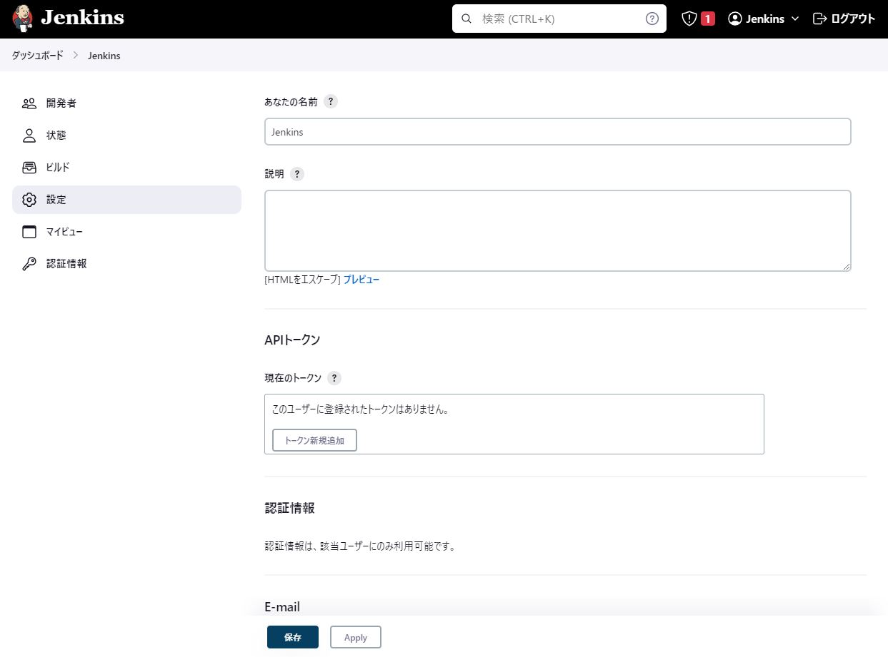
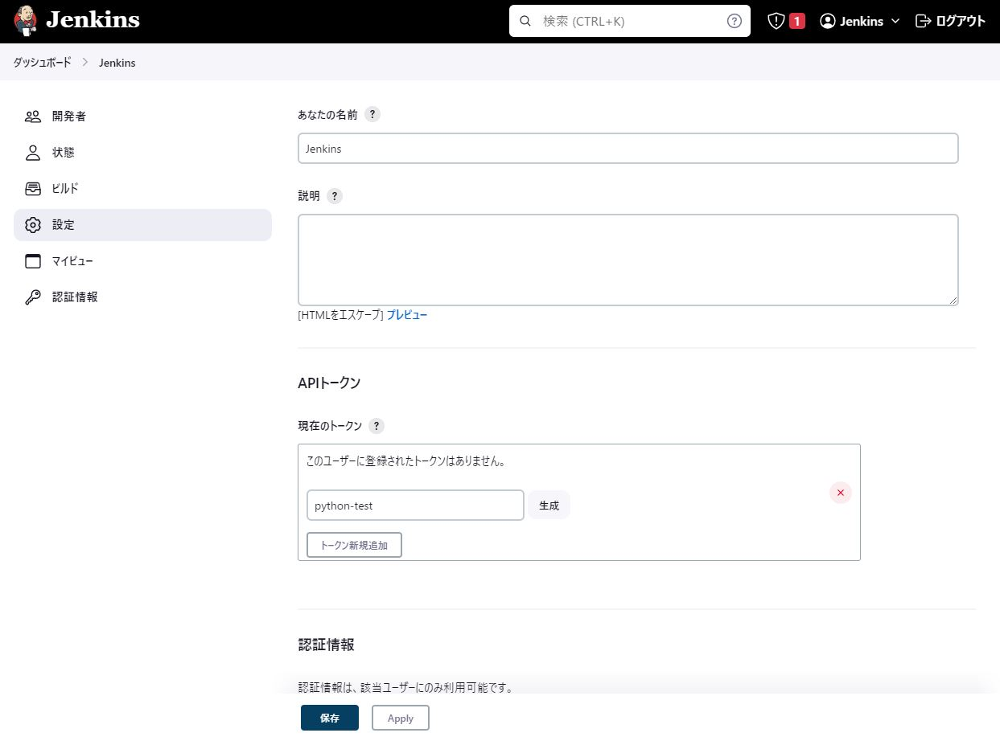
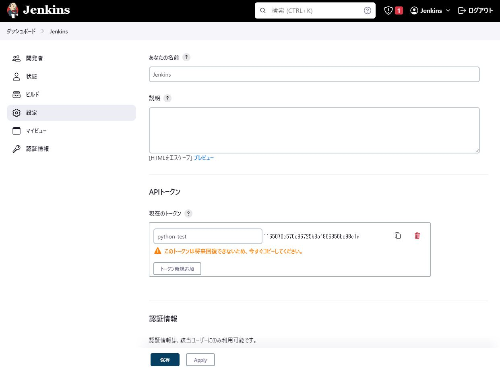

生成されたトークンのコピーボタンと思われるボタンがあるのですが、そのボタンでコピーできないのは私のブラウザ設定がアレなせいだと思っています。

PATHの登録
==========

sonar-scanner を標準パスにインストールしていないので sonar-scanner へのパスを設定します。

* 設定値

    ==== ====================================================
    項目 設定値
    ==== ====================================================
    キー PATH+EXTRA
    値   /var/jenkins_home/sonar-scanner-4.8.0.2856-linux/bin
    ==== ====================================================

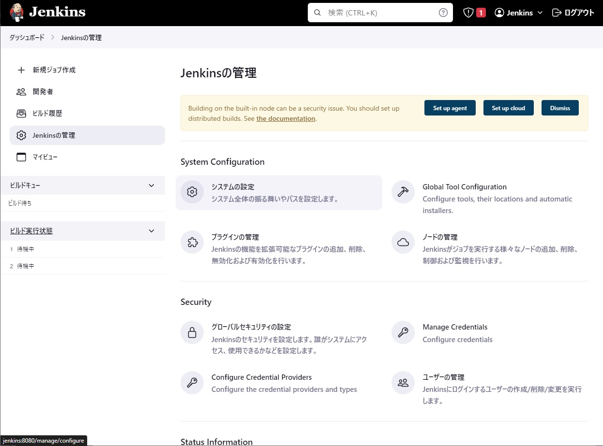
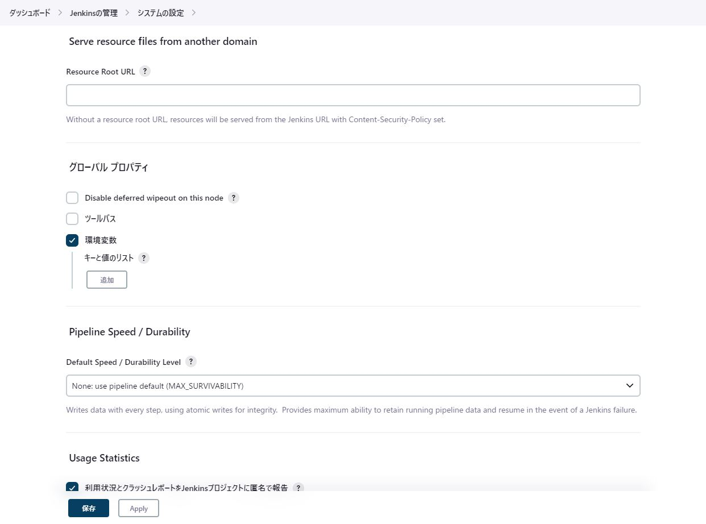
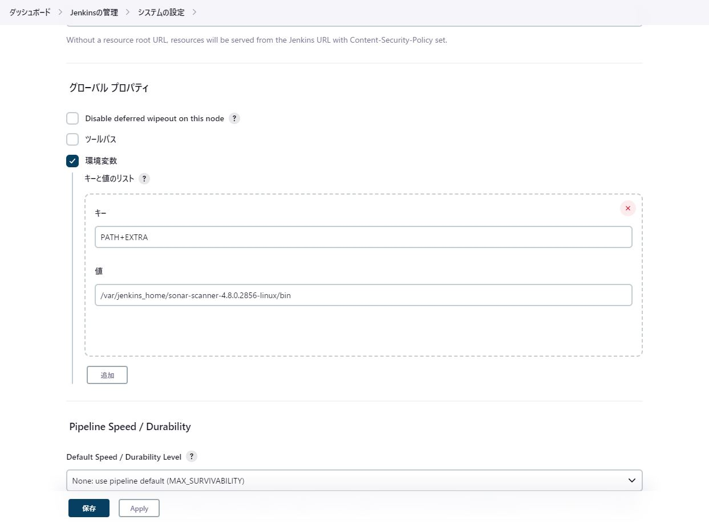

Subversionプラグインのインストール
==================================

Subversionプラグインは `Install suggested plugins` に含まれていないので、手動インストールが必要です。

.. image:: ./04_jenkins/jenkins_plugin_menu.jpeg
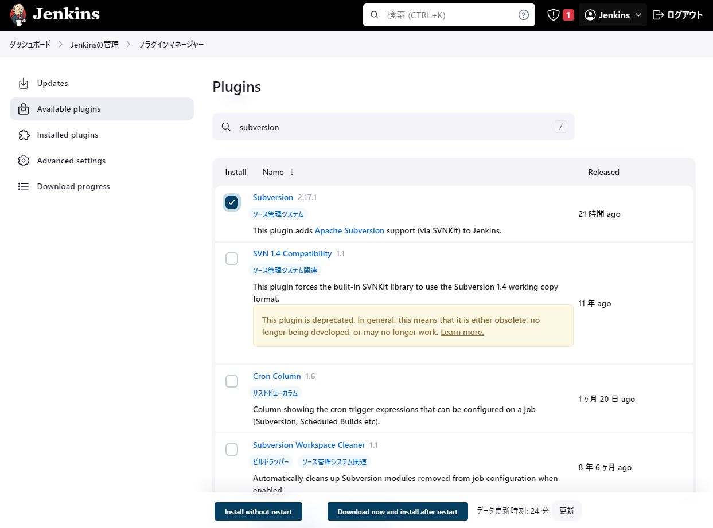
