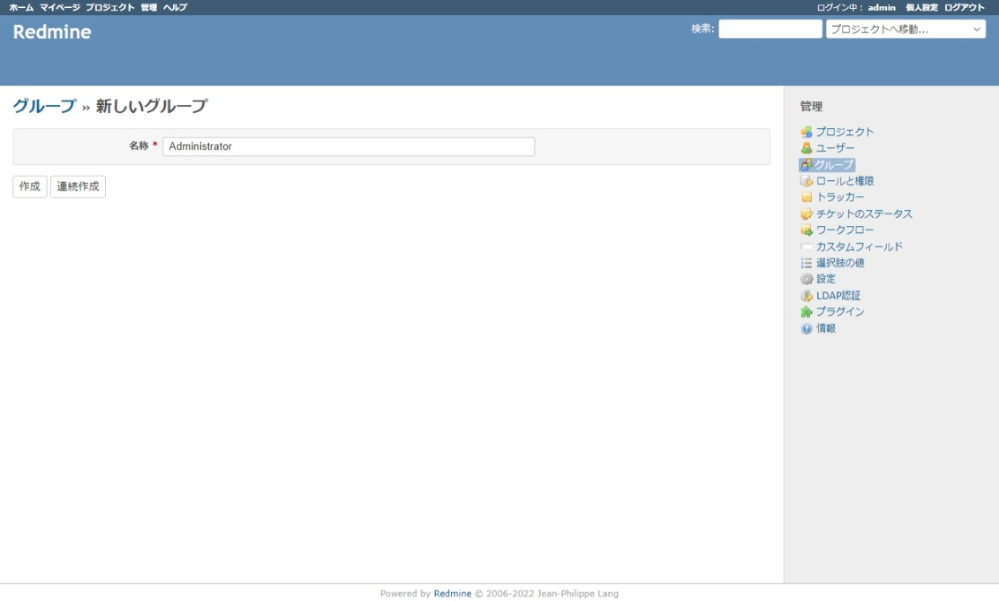
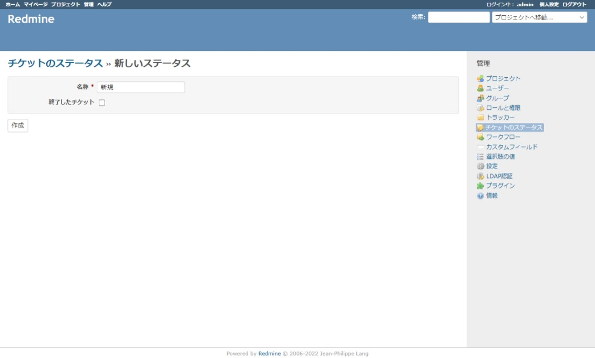
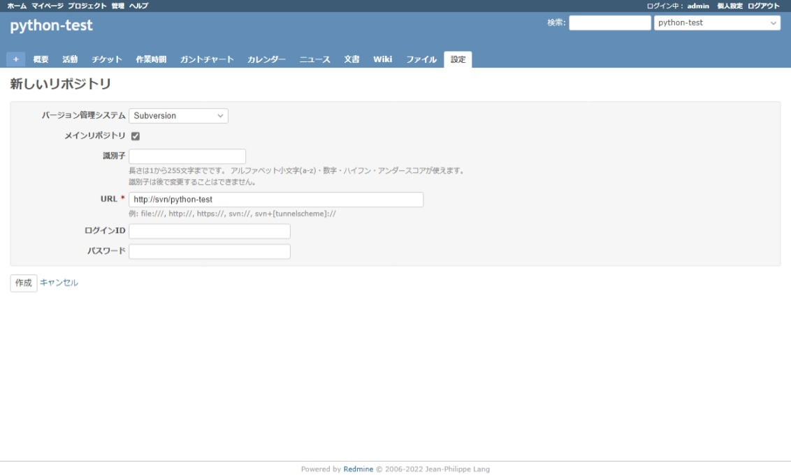

#######
Redmine
#######

.. note::

    Subversion にファイルをコミットする時、コミットメッセージに Redmine のチケット ID を付けておくと、そのチケットでどのファイルをコミットしたのか関連付けすることができます。

============
初回ログイン
============

| 　ブラウザで `IPアドレス:3000` を参照します。
| 　画面右上の `ログイン` からログイン画面に遷移し、初期ログインID／パスワードを入力すると、管理者パスワードの変更画面に遷移します。

========== =====
項目       値
========== =====
ログインID admin
パスワード admin
========== =====

.. image:: ./07_redmine/redmine_login_first.jpeg

　adminアカウントでは、初回ログイン時のパスワード変更が必須です。

.. image:: ./07_redmine/redmine_change_admin_pass.jpeg

　パスワードを変更すると、adminアカウントの設定画面に遷移します。

========
初期設定
========

ユーザ
******

`管理 ⇒ ユーザ ⇒ 新しいユーザ` から Redmine を利用するユーザを登録します。

グループ
********

| `管理 ⇒ グループ ⇒ 新しいグループ` から Redmine を利用するユーザを所属させるグループを登録します。
| 運用方針にも依りますが下記 3 つのグループを登録しておきます。

* Administrator
* User
* Guest

ロールと権限
************

| `管理 ⇒ ロールと権限 ⇒ 新しいロール` から Redmine のロールと権限を設定します。
| 運用方針にも依りますが下記 3 つのロールを登録しておきます。

* 管理者
* 一般ユーザ
* ゲスト

トラッカー
**********

| `管理 ⇒ トラッカー` のから下記のトラッカーを定義します。
| `デフォルトのステータス` が必須項目のため、先に `チケットのステータス` を設定する必要があります。

* 機能追加
* 機能改修
* バグ対応

チケットのステータス
********************

| `管理` ⇒ `チケットのステータス` のリンクをたどり、下記のステータスを定義しておきます。
| 最後の `完了` だけ `終了したチケット` のチェックボックスに✓をします。

* 新規
* 対応中
* レビュー待ち
* レビュー中
* 完了
* 見送り

ワークフロー
************

選択肢の値
**********

| `管理` ⇒ `選択肢の値` のリンクをたどり、それぞれの `新しい値` から、それぞれの項目で使用する値を登録します。

* 文書のカテゴリ

    * メモ
    * 設計書・仕様書

* チケットの優先度

    * 緊急
    * 高優先
    * 通常
    * 低優先

* 作業分類

    * 検討
    * コーディング
    * テスト

==================
プロジェクトの登録
==================

SCMの設定
*********

| Subversion リポジトリ URL には Redmine から Subversion につながる IPアドレス または FQDN を設定します。
| ここでは、Docker内の仕組みで名前を解決するホスト名の `svn` を設定しています。

Subersion-Redmine連携
*********************

* `バージョン管理システムとの連携 <https://redmine.jp/tech_note/subversion/>`_
* `svnコミット時にredmineのチケットと複数関連付ける方法 <https://nrbm-akatsuki.com/125/>`_
* `Redmine がらみの Subversion hook 設定 <https://miau.hatenablog.com/entry/20110530/1306764424>`_

Redmine の設定
--------------

Subversion へのコミット時に、Subversion のコミットログと Redmine のチケットの関連付けを更新するための API を実行するため、API キーを発行を発行します。

Subversion の設定
-----------------

`/var/svnroot/python-test/hooks/post-commit` に API の実行を登録しておくと、Subversion にコミットした後に、Subversion のコミットログと Redmine のチケットの関連付けを更新してくれるようになります。

.. code:: bash

    bash -c 'echo -e "\nredmine_apikey=S5zn1IZPMeq6mLZIPDiy" >> /var/svnroot/python-test/hooks/post-commit'
    bash -c 'echo "redmine_project=python-test" >> /var/svnroot/python-test/hooks/post-commit'
    bash -c 'echo  "/usr/bin/wget -q -O /dev/null http://redmine:3000/sys/fetch_changesets?key=\${redmine_apikey}&id=\${redmine_project}" >> /var/svnroot/python-test/hooks/post-commit'

Subversion コミットログ
-----------------------

| `refs #チケットID` をコミットログに入れておくと、Redmine のチケットに Subversion のコミットログを関連付けられます。
| `refs #チケットID` の入れ方は数パターンあるので、コミットログの書式にあったつけ方を検討してください。

.. code:: text

    refs #1
    xxx機能新規サポート
